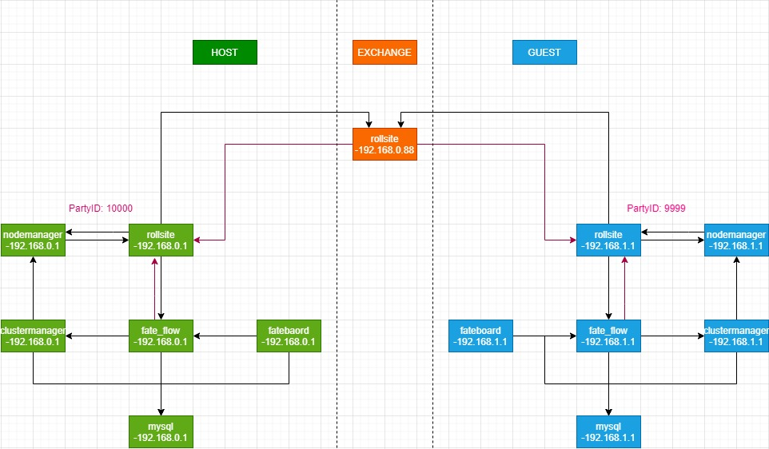

# ansible 部署FATE集群三边场景示例

### 1 概述

​       本章介绍通过ansible 部署FATE集群的三边场景，架构图如下：



### 2 部署目标介绍

（1） Host端

Party Id: 10000

| 角色           | IP          | 端口      | 介绍                                   |
| -------------- | ----------- | --------- | -------------------------------------- |
| rollsite       | 192.168.0.1 | 9370      | 跨站点或者说跨party通讯组件            |
| fate_flow      | 192.168.0.1 | 9360;9380 | 联合学习任务流水线管理模块             |
| clustermanager | 192.168.0.1 | 4670      | cluster manager管理集群                |
| nodemanager     | 192.168.0.1 | 4671      | node manager管理每台机器资源           |
| fateboard      | 192.168.0.1 | 8080      | 联合学习过程可视化模块                 |
| mysql          | 192.168.0.1 | 3306      | 数据存储，clustermanager和fateflow依赖 |

（2） Guest端

Party Id: 9999

| 角色           | IP          | 端口      | 介绍                                   |
| -------------- | ----------- | --------- | -------------------------------------- |
| rollsite       | 192.168.1.1 | 9370      | 跨站点或者说跨party通讯组件            |
| fate_flow      | 192.168.1.1 | 9360;9380 | 联合学习任务流水线管理模块             |
| clustermanager | 192.168.1.1 | 4670      | cluster manager管理集群                |
| nodemanager     | 192.168.1.1 | 4671      | node manager管理每台机器资源           |
| fateboard      | 192.168.1.1 | 8080      | 联合学习过程可视化模块                 |
| mysql          | 192.168.1.1 | 3306      | 数据存储，clustermanager和fateflow依赖 |

（2） exchange端

| 角色     | IP           | 端口 | 介绍                        |
| -------- | ------------ | ---- | --------------------------- |
| rollsite | 192.168.0.88 | 9370 | 跨站点或者说跨party通讯组件 |

### 3 进入部署包根目录

 请按需使用合适的方式获取部署包，并解压，然后进入【部署包根目录】。具体操作指引请参考<<[部署手册](ansible_deploy_FATE_manual.md)>> 2.4.1和2.6.1等章节。

```
cd 【部署包根目录】
```


### 4 配置

#### 4.1 初始化配置

- 步骤1：使用辅助脚本产生初始化配置

```
bash deploy/deploy.sh init -h="10000:192.168.0.1" -g="9999:192.168.1.1" -e="192.168.0.88" -k="host|exchange"
```

- 步骤2： 修改配置

```
vim deploy/conf/setup.conf
```

```
env: prod
pname: fate
ssh_port: 22
deploy_user: app
deploy_group: apps
deploy_mode: deploy
modules:
  - mysql
  - eggroll
  - fate_flow
  - fateboard
roles:
  - host:10000
  - guest:9999
  - exchange:0
ssl_roles:
  - host
  - exchange
polling: {}
host_ips:
  - default:192.168.0.1
host_special_routes: []
guest_ips:
  - default:192.168.1.1
guest_special_routes: []
exchange_ips:
  - default:192.168.0.88
exchange_special_routes: []
default_engines: eggroll
```

如果部署需要证书验证，则执行命令：

```
bash deploy/deploy.sh keys
```

- 步骤3：执行辅助脚本产生配置

```
bash deploy/deploy.sh render
```


#### 4.2 配置host信息

如需要自定义高级配置，可参考<<[部署手册](ansible_deploy_FATE_manual.md)>> 2.5.3一节，修改如下文件，默认可以不修改。

 ```
vi var_files/prod/fate_host
 ```

内容如下：

```
host:
  partyid: 10000
  rollsite:
    enable: True
    coordinator: fate
    ips:
    - 192.168.0.1
    port: 9370	---服务端口
    secure_port: 9371
    server_secure: True
    client_secure: True
    polling:
      enable: False
    route_tables:
    - id: default
      routes:
      - name: default
        ip: 192.168.1.1
        port: 9371
        is_secure: True
    - id: 10000
      routes:
      - name: default
        ip: 192.168.0.1
        port: 9370
        is_secure: false
      - name: fateflow
        ip: 192.168.0.1
        port: 9360
  clustermanager:
    enable: True
    ips:
    - 192.168.0.1
    port: 4670
    cores_per_node: 16
  nodemanager:
    enable: True
    ips:
    - 192.168.0.1
    port: 4671
  eggroll:
    dbname: "eggroll_meta"
    egg: 4
  fate_flow:
    enable: True
    ips:
    - 192.168.0.1
    grpcPort: 9360
    httpPort: 9380
    dbname: "fate_flow"
    proxy: rollsite
    http_app_key:
    http_secret_key:
    use_deserialize_safe_module: false
    default_engines: eggroll
  fateboard:
    enable: True
    ips:
    - 192.168.0.1
    port: 8080
    dbname: "fate_flow"
  mysql:
    enable: True
    type: inside
    ips:
    - 192.168.0.1
    port: 3306
    dbuser: "fate"
    dbpasswd: "fate_deV2999"
  zk:
    enable: False
    lists:
    - ip: 192.168.0.1
      port: 2181
    use_acl: false
    user: "fate"
    passwd: "fate"
  servings:
    ips:
    - 192.168.0.1
    port: 8000
```

#### 4.3 配置guest信息

如需要自定义高级配置，可参考<<[部署手册](ansible_deploy_FATE_manual.md) >>2.5.3一节，修改如下文件，默认可以不修改。

```
vi var_files/prod/fate_guest
```

内容如下：

```
guest:
  partyid: 9999
  rollsite:
    enable: True
    coordinator: fate
    ips:
    - 192.168.1.1
    port: 9370	---服务端口
    secure_port: 9371
    server_secure: False
    client_secure: False
    polling:
      enable: False
    route_tables:
    - id: default
      routes:
      - name: default
        ip: 192.168.0.1
        port: 9370
        is_secure: False
    - id: 10000
      routes:
      - name: default
        ip: 192.168.1.1
        port: 9370
        is_secure: false
      - name: fateflow
        ip: 192.168.1.1
        port: 9360
  clustermanager:
    enable: True
    ips:
    - 192.168.1.1
    port: 4670
    cores_per_node: 16
  nodemanager:
    enable: True
    ips:
    - 192.168.1.1
    port: 4671
  eggroll:
    dbname: "eggroll_meta"
    egg: 4
  fate_flow:
    enable: True
    ips:
    - 192.168.1.1
    grpcPort: 9360
    httpPort: 9380
    dbname: "fate_flow"
    proxy: rollsite
    http_app_key:
    http_secret_key:
    use_deserialize_safe_module: false
    default_engines: eggroll
  fateboard:
    enable: True
    ips:
    - 192.168.1.1
    port: 8080
    dbname: "fate_flow"
  mysql:
    enable: True
    type: inside
    ips:
    - 192.168.1.1
    port: 3306
    dbuser: "fate"
    dbpasswd: "fate_deV2999"
  zk:
    enable: False
    lists:
    - ip: 192.168.1.1
      port: 2181
    use_acl: false
    user: "fate"
    passwd: "fate"
  servings:
    ips:
    - 192.168.1.1
    port: 8000
```

#### 4.4 配置exchange信息

如需要自定义高级配置，可参考<<[部署手册](ansible_deploy_FATE_manual.md)>> 2.5.3一节，修改如下文件，默认可以不修改。

```
vi var_files/prod/fate_exchange
```

内容如下：

```
exchange:
  rollsite:
    enable: True
    coordinator: fate
    ips:
    - 192.168.0.88
    port: 9370
    secure_port: 9371
    server_secure: True
    client_secure: True
    polling:
      enable: False
      ids:
      - 10000
  	route_tables:
  	- id: 10000
      routes:
      - name: default
        ip: 192.168.0.1
        port: 9371
        is_secure: True
    - id: 10000
      routes:
      - name: default
        ip: 192.168.1.1
        port: 9370
        is_secure: False
```


### 5 执行部署

- 部署所有服务

```
bash deploy/deploy.sh deploy
```

查看部署日志：`tailf logs/deploy-??.log`


### 6 后置操作

具体操作指引请参考<<[部署手册](ansible_deploy_FATE_manual.md)>> 2.6.8一节。


### 7 服务验证与测试

具体操作指引请参考<<[部署手册](ansible_deploy_FATE_manual.md)>> 2.7一节。
